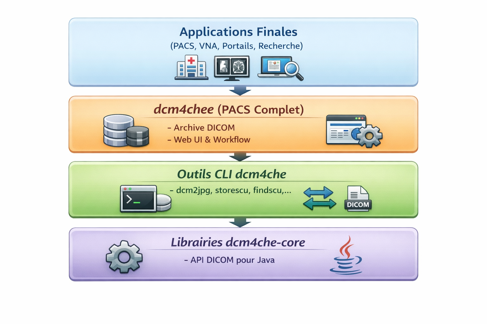
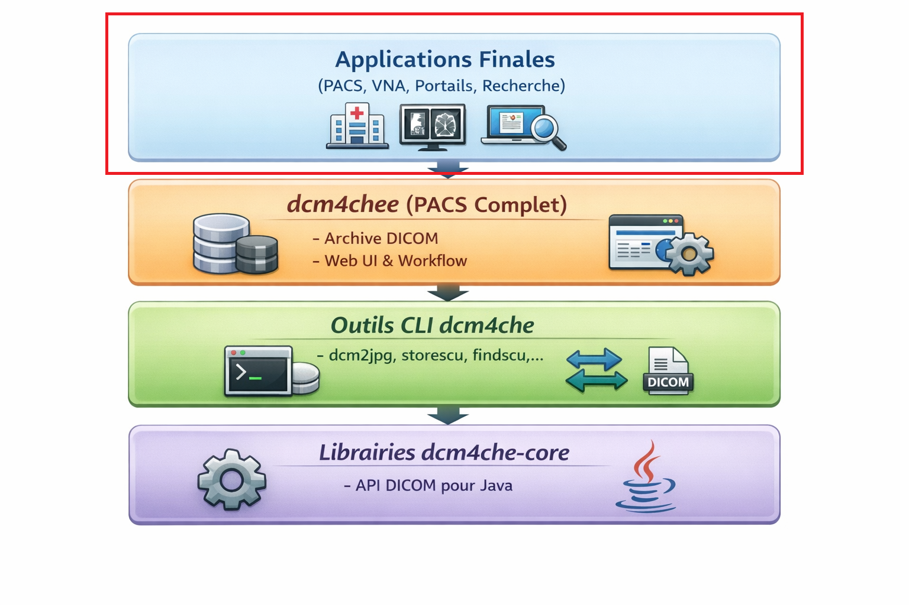
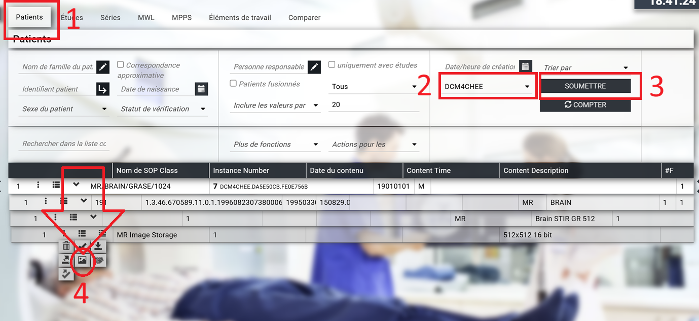

------------------------------------------------------------------------------------------------------
ATELIER PACS
------------------------------------------------------------------------------------------------------
L’idée en 30 secondes : Cet atelier est un **PACS open source complet** basé sur les bibliothèques dcm4che, qui **permet de stocker, indexer et distribuer des images médicales au format DICOM**. Il gère la réception d’examens depuis les modalités (scanner, IRM, radiographie…), l’archivage sécurisé des études, la recherche des patients et examens **via une interface web**, ainsi que l’exposition des données en DICOMweb (QIDO, WADO, STOW) pour des viewers ou des systèmes tiers. Utilisé en recherche, en enseignement et dans certains environnements cliniques, dcm4chee sert de socle PACS pour **comprendre et expérimenter les flux d’imagerie médicale dans un SIH**.  
  
-------------------------------------------------------------------------------------------------------
Séquence 1 : Codespace de Github
-------------------------------------------------------------------------------------------------------
Objectif : Création d'un Codespace Github  
Difficulté : Très facile (~5 minutes)
-------------------------------------------------------------------------------------------------------
**1°** - Créer vous un compte sur GitHub : Si besoin, un vidéo pour vous aider à créer votre propre compte GitHUB : [Créer un compte GitHUB](https://docs.github.com/fr/get-started/onboarding/getting-started-with-your-github-account) A noter que **si vous possédez déjà un compte GitHUB vous pouvez le conserver pour réaliser cet atelier**. Pas besion d'en créer un nouveau.  
  
**2°** - **Faites un Fork de ce projet**. Si besion, voici une vidéo d'accompagnement pour vous aider dans les "Forks" : [Forker ce projet](https://youtu.be/p33-7XQ29zQ) 
  
**3°** - Ensuite depuis l'onglet **[CODE]** de votre nouveau Repository, **ouvrez un Codespace Github**.

---------------------------------------------------
Séquence 2 : Création de l'environnement de travail
---------------------------------------------------
Objectif : Mettre en service les outils DICOM CLI (Modalités)  
Difficulté : Simple (~15 minutes)
---------------------------------------------------
Dans cette séquence, vous allez mettre en place un environnement permettant de simuler des modalités d’imagerie médicale (scanner, radiographie, etc.).  

**Positionnement de cette séquence dans une architecture PACS :** Ci-dessous, les différentes couches techniques d'un PACS. Cette caisse à outils DICOM s'intercale entre un socle Java et l'environnement PACS utilisateurs.   
  
 

Dans le terminal du Codespace copier/coller les codes ci-dessous etape par étape :
    
**Mise en service des outils DICOM CLI**  
```
sudo apt-get update
sudo apt-get install -y openjdk-17-jdk
```
```
sudo update-alternatives --set java /usr/lib/jvm/java-17-openjdk-amd64/bin/java
sudo update-alternatives --set javac /usr/lib/jvm/java-17-openjdk-amd64/bin/javac
```
```
export JAVA_HOME=/usr/lib/jvm/java-17-openjdk-amd64
export PATH="$JAVA_HOME/bin:/usr/bin:$PATH"
```
```
./mvnw -DskipTests install -pl dcm4che-assembly -am
```
```
unzip -o dcm4che-assembly/target/dcm4che-*-bin.zip
```
```
BIN_DIR="$(ls -d "$PWD"/dcm4che-*/bin | head -n 1)"
```
```
export PATH="$BIN_DIR:$PATH"
```
  
Les outils ci-dessous sont à présent en service et peuvent être utilisés en mode CLI (ligne de commandes).
---------
- [agfa2dcm][]: Extract DICOM files from Agfa BLOB file
- [agfa2sr][]: Extract concatenated XML Agfa Reports and convert them to DICOM SR Documents
- [dcm2dcm][]: Transcode DICOM file according the specified Transfer Syntax
- [dcm2jpg][]: Convert DICOM image to JPEG or other image formats
- [dcm2json][]: Convert DICOM file in JSON presentation
- [dcm2pdf][]: Extract encapsulated PDF, CDA or STL from DICOM file
- [dcm2str][]: Apply Attributes Format Pattern to dicom file or command line parameters.
- [dcm2xml][]: Convert DICOM file in XML presentation
- [dcmbenchmark][]: Parse a DICOM file repetitively, measuring time and used memory
- [dcmdir][]: Dump, create or update DICOMDIR file
- [dcmdump][]: Dump DICOM file in textual form
- [dcmldap][]: Insert/remove configuration entries for Network AEs into/from LDAP server
- [dcmqrscp][]: Simple DICOM archive
- [dcmvalidate][]: Validate DICOM object according a specified Information Object Definition
- [deidentify][]: De-identify one or several DICOM files
- [emf2sf][]: Convert DICOM Enhanced Multi-frame image to legacy DICOM Single-frame images
- [findscu][]: Invoke DICOM C-FIND Query Request
- [fixlo2un][]: Fixes length of private tags truncated to 2 bytes on conversion from implicit VR to explicit VR Transfer Syntax
- [getscu][]: Invoke DICOM C-GET Retrieve Request
- [hl72xml][]: Convert HL7 v2.x message in XML presentation
- [hl7pdq][]: Query HL7 v2.x Patient Demographics Supplier
- [hl7pix][]: Query HL7 v2.x PIX Manager
- [hl7rcv][]: HL7 v2.x Receiver
- [hl7snd][]: Send HL7 v2.x message
- [ianscp][]: DICOM Instance Availability Notification receiver 
- [ianscu][]: Send DICOM Instance Availability Notification
- [jpg2dcm][]: Convert JPEG images or MPEG videos in DICOM files
- [json2dcm][]: Converts JSON file to DICOM file
- [json2index][]: Creates search index for UI configuration from JSON schema files
- [json2props][]: Convert Archive configuration schema JSON files to key/value properties files and vice versa
- [json2rst][]: Generate ReStructuredText files from Archive configuration schema JSON files
- [maskpxdata][]: Mask information burned into the Pixel Data
- [mkkos][]: Make DICOM Key Object Selection Document
- [modality][]: Simulates DICOM Modality
- [movescu][]: Invoke DICOM C-MOVE Retrieve request
- [mppsscp][]: DICOM Modality Performed Procedure Step Receiver
- [mppsscu][]: Send DICOM Modality Performed Procedure Step
- [pdf2dcm][]: Convert PDF file into DICOM file
- [planarconfig][]: Detects the actual planar configuration of uncompressed pixel data of color images with Photometric Interpretation RGB or YBR_FULL and optionally correct non matching values of attribute Planar Configuration of the image
- [qstar][]: QStar SOAP Client to prefetch/retrieve or fetch file information of specified files
- [stgcmtscu][]: Invoke DICOM Storage Commitment Request
- [storescp][]: DICOM Composite Object Receiver
- [storescu][]: Send DICOM Composite Objects
- [stowrs][]: Send DICOM Composite Objects or Bulkdata file over Web
- [stowrsd][]: STOW-RS Server
- [swappxdata][]: Swaps bytes of uncompressed pixel data in DICOM files
- [syslog][]: Send Syslog messages via TCP/TLS or UDP to a Syslog Receiver
- [syslogd][]: Receives RFC 5424 Syslog messages via TCP/TLS or UDP
- [tpl2xml][]: Converts private dictionaries present in template file(s) to xml file(s).
- [upsscu][]: Invokes services of Unified Procedure Step Service Class
- [wadors][]: Wado RS Client Simulator 
- [wadows][]: Wado WS Client Simulator 
- [xml2dcm][]: Create/Update DICOM file from/with XML presentation
- [xml2hl7][]: Create HL7 v2.x message from XML presentation
- [xroad][]: XRoad SOAP Client to query Estonia National Patient Registry for Patient Demographics

[agfa2dcm]: https://github.com/dcm4che/dcm4che/blob/master/dcm4che-tool/dcm4che-tool-agfa2dcm/README.md
[agfa2sr]: https://github.com/dcm4che/dcm4che/blob/master/dcm4che-tool/dcm4che-tool-agfa2sr/README.md
[dcm2dcm]: https://github.com/dcm4che/dcm4che/blob/master/dcm4che-tool/dcm4che-tool-dcm2dcm/README.md
[dcm2jpg]: https://github.com/dcm4che/dcm4che/blob/master/dcm4che-tool/dcm4che-tool-dcm2jpg/README.md
[dcm2json]: https://github.com/dcm4che/dcm4che/blob/master/dcm4che-tool/dcm4che-tool-dcm2json/README.md
[dcm2pdf]: https://github.com/dcm4che/dcm4che/blob/master/dcm4che-tool/dcm4che-tool-dcm2pdf/README.md
[dcm2str]: https://github.com/dcm4che/dcm4che/blob/master/dcm4che-tool/dcm4che-tool-dcm2str/README.md
[dcm2xml]: https://github.com/dcm4che/dcm4che/blob/master/dcm4che-tool/dcm4che-tool-dcm2xml/README.md
[dcmbenchmark]: https://github.com/dcm4che/dcm4che/blob/master/dcm4che-tool/dcm4che-tool-dcmbenchmark/README.md
[dcmdir]: https://github.com/dcm4che/dcm4che/blob/master/dcm4che-tool/dcm4che-tool-dcmdir/README.md
[dcmdump]: https://github.com/dcm4che/dcm4che/blob/master/dcm4che-tool/dcm4che-tool-dcmdump/README.md
[dcmldap]: https://github.com/dcm4che/dcm4che/blob/master/dcm4che-tool/dcm4che-tool-dcmldap/README.md
[dcmqrscp]: https://github.com/dcm4che/dcm4che/blob/master/dcm4che-tool/dcm4che-tool-dcmqrscp/README.md
[dcmvalidate]: https://github.com/dcm4che/dcm4che/blob/master/dcm4che-tool/dcm4che-tool-dcmvalidate/README.md
[deidentify]: https://github.com/dcm4che/dcm4che/blob/master/dcm4che-tool/dcm4che-tool-deidentify/README.md
[emf2sf]: https://github.com/dcm4che/dcm4che/blob/master/dcm4che-tool/dcm4che-tool-emf2sf/README.md
[findscu]: https://github.com/dcm4che/dcm4che/blob/master/dcm4che-tool/dcm4che-tool-findscu/README.md
[fixlo2un]: https://github.com/dcm4che/dcm4che/blob/master/dcm4che-tool/dcm4che-tool-fixlo2un/README.md
[getscu]: https://github.com/dcm4che/dcm4che/blob/master/dcm4che-tool/dcm4che-tool-getscu/README.md
[hl72xml]: https://github.com/dcm4che/dcm4che/blob/master/dcm4che-tool/dcm4che-tool-hl72xml/README.md
[hl7pdq]: https://github.com/dcm4che/dcm4che/blob/master/dcm4che-tool/dcm4che-tool-hl7pdq/README.md
[hl7pix]: https://github.com/dcm4che/dcm4che/blob/master/dcm4che-tool/dcm4che-tool-hl7pix/README.md
[hl7rcv]: https://github.com/dcm4che/dcm4che/blob/master/dcm4che-tool/dcm4che-tool-hl7rcv/README.md
[hl7snd]: https://github.com/dcm4che/dcm4che/blob/master/dcm4che-tool/dcm4che-tool-hl7snd/README.md
[ianscp]: https://github.com/dcm4che/dcm4che/blob/master/dcm4che-tool/dcm4che-tool-ianscp/README.md
[ianscu]: https://github.com/dcm4che/dcm4che/blob/master/dcm4che-tool/dcm4che-tool-ianscu/README.md
[jpg2dcm]: https://github.com/dcm4che/dcm4che/blob/master/dcm4che-tool/dcm4che-tool-jpg2dcm/README.md
[json2dcm]: https://github.com/dcm4che/dcm4che/blob/master/dcm4che-tool/dcm4che-tool-json2dcm/README.md
[json2index]: https://github.com/dcm4che/dcm4che/blob/master/dcm4che-tool/dcm4che-tool-json2index/README.md
[json2props]: https://github.com/dcm4che/dcm4che/blob/master/dcm4che-tool/dcm4che-tool-json2props/README.md
[json2rst]: https://github.com/dcm4che/dcm4che/blob/master/dcm4che-tool/dcm4che-tool-json2rst/README.md
[maskpxdata]: https://github.com/dcm4che/dcm4che/blob/master/dcm4che-tool/dcm4che-tool-maskpxdata/README.md
[mkkos]: https://github.com/dcm4che/dcm4che/blob/master/dcm4che-tool/dcm4che-tool-mkkos/README.md
[modality]: https://github.com/dcm4che/dcm4che/blob/master/dcm4che-tool/dcm4che-tool-ihe/dcm4che-tool-ihe-modality/README.md
[movescu]: https://github.com/dcm4che/dcm4che/blob/master/dcm4che-tool/dcm4che-tool-movescu/README.md
[mppsscp]: https://github.com/dcm4che/dcm4che/blob/master/dcm4che-tool/dcm4che-tool-mppsscp/README.md
[mppsscu]: https://github.com/dcm4che/dcm4che/blob/master/dcm4che-tool/dcm4che-tool-mppsscu/README.md
[pdf2dcm]: https://github.com/dcm4che/dcm4che/blob/master/dcm4che-tool/dcm4che-tool-pdf2dcm/README.md
[planarconfig]: https://github.com/dcm4che/dcm4che/blob/master/dcm4che-tool/dcm4che-tool-planarconfig/README.md
[qstar]: https://github.com/dcm4che/dcm4che/blob/master/dcm4che-tool/dcm4che-tool-qstar/README.md
[stgcmtscu]: https://github.com/dcm4che/dcm4che/blob/master/dcm4che-tool/dcm4che-tool-stgcmtscu/README.md
[storescp]: https://github.com/dcm4che/dcm4che/blob/master/dcm4che-tool/dcm4che-tool-storescp/README.md
[storescu]: https://github.com/dcm4che/dcm4che/blob/master/dcm4che-tool/dcm4che-tool-storescu/README.md
[stowrs]: https://github.com/dcm4che/dcm4che/blob/master/dcm4che-tool/dcm4che-tool-stowrs/README.md
[stowrsd]: https://github.com/dcm4che/dcm4che/blob/master/dcm4che-tool/dcm4che-tool-stowrsd/README.md
[swappxdata]: https://github.com/dcm4che/dcm4che/blob/master/dcm4che-tool/dcm4che-tool-swappxdata/README.md
[syslog]: https://github.com/dcm4che/dcm4che/blob/master/dcm4che-tool/dcm4che-tool-syslog/README.md
[syslogd]: https://github.com/dcm4che/dcm4che/blob/master/dcm4che-tool/dcm4che-tool-syslogd/README.md
[tpl2xml]: https://github.com/dcm4che/dcm4che/blob/master/dcm4che-tool/dcm4che-tool-tpl2xml/README.md
[upsscu]: https://github.com/dcm4che/dcm4che/blob/master/dcm4che-tool/dcm4che-tool-upsscu/README.md
[wadors]: https://github.com/dcm4che/dcm4che/blob/master/dcm4che-tool/dcm4che-tool-wadors/README.md
[wadows]: https://github.com/dcm4che/dcm4che/blob/master/dcm4che-tool/dcm4che-tool-wadows/README.md
[xml2dcm]: https://github.com/dcm4che/dcm4che/blob/master/dcm4che-tool/dcm4che-tool-xml2dcm/README.md
[xml2hl7]: https://github.com/dcm4che/dcm4che/blob/master/dcm4che-tool/dcm4che-tool-xml2hl7/README.md
[xroad]: https://github.com/dcm4che/dcm4che/blob/master/dcm4che-tool/dcm4che-tool-xroad/README.md

---------------------------------------------------
Séquence 3 : Installation du PACS
---------------------------------------------------
Objectif : Installer le PACS utilisateurs   
Difficulté : facile (~10 minutes)
---------------------------------------------------
Dans cette séquence, vous allez installer un PACS dans votre environnement Codespace.  

**Positionnement de cette séquence dans une architecture PACS :**   
  
 

Dans le terminal du Codespace copier/coller les codes ci-dessous etape par étape :
    
**Installtion du PACS**  
```
docker-compose up -d
```
**Réccupération de l'URL de l'application PACS** 
Votre application PACS est déployée dans votre environnement Codespace. Pour obtenir votre URL de votre PACS cliquez sur l'onglet **[PORTS]** dans votre Codespace et rendez public votre port **8443** (Visibilité du port).  
**Important** : à la fin coller **/dcm4chee-arc/ui2/fr/index.html** à la fin de votre URL. C'est terminé !

---------------------------------------------------
Séquence 4 : Envoyer une image DICOM dans le PACS
---------------------------------------------------
Objectif : Simuler une modalité qui envoie une image DICOM dans le PACS  
Difficulté : simple (~15 minutes)
---------------------------------------------------
Dans cette séquence nous allons simuler une modalité qui envoie l'image DICOM de Mr Brain dans le PACS.  
Le répertoire samples de ce Repository contient quelques images DICOM prêtes à l'emploi et pouvant être envoyées dans le PACS.  

**Positionnement de cette séquence dans une architecture PACS :**   
  
   
  
Envoyons une image dans le PACS. Dans le terminal du Codespace copier/coller le code suivant :
    
```
storescu -c DCM4CHEE@localhost:11112 ./samples/0001.DCM
```
  
**Visionner une image dans le PACS**    
Nous pouvons à présente retrouver l'image de Mr Brain dans le PACS via le processus suivant :


  
---------------------------------------------------
Séquence 5 : Exercice
---------------------------------------------------
Objectif : Prendre en main l'environnement PACS  
Difficulté : Simple (~15 minutes)
---------------------------------------------------
Le répertoire samples de votre Codespace contient plusieurs images DICOM 0002.DMC, 0003.DMC et 0004.DMC.  
**Travail demandé :** Envoyez les images 0002.DMC, 0003.DMC et 0004.DMC dans le PACS et visionner le résultat via l'interface Web.  
  
---------------------------------------------------
Séquence 6 : Atelier N° 1
---------------------------------------------------
Objectif : Découvrir les outils PACS  
Difficulté : Moyenne (~1h30)
---------------------------------------------------
Choisir 5 outils dans le PACS disponibles dans cet atelier et expliquez nous leur utilités et comment les utiliser.  
**Complétez et documentez ce fichier README.md** pour nous présenter ces 5 outils et comment les utiliser.  

**Outil PACS N°1**  
Cet outil est utilisé pour ... voici comment l'utiliser ...

**Outil PACS N°2**  
Cet outil est utilisé pour ... voici comment l'utiliser ...  

**Outil PACS N°3**  
Cet outil est utilisé pour ... voici comment l'utiliser ...  

**Outil PACS N°4**  
Cet outil est utilisé pour ... voici comment l'utiliser ...  

**Outil PACS N°5**  
Cet outil est utilisé pour ... voici comment l'utiliser ...  

---------------------------------------------------
Séquence 7 : Atelier N° 2
---------------------------------------------------
Objectif : Zoom sur un outil PACS  
Difficulté : Moyenne (~1h)
---------------------------------------------------
Parmi les cinq outils PACS qui vous ont été présentés, choisissez-en un et proposez un atelier à réaliser en classe. **Complétez et documentez cette section de README.md** afin de présenter clairement votre atelier (objectifs, étapes, prérequis, résultats attendus).  

---------------------------------------------------
Evaluation
---------------------------------------------------
Cet atelier, **noté sur 20 points**, est évalué sur la base du barème suivant :  
- Pertinance des explications sur les outils PACS présentés (5 points)
- Qualité du scénario présenté dans l'atelier N°2 (4 points)
- Degré de technicité des ateliers 1 et 2 (4 points)
- Qualité du Readme (lisibilité, erreur, ...) (4 points)
- Processus travail (quantité de commits, cohérence globale, interventions externes, ...) (3 points) 
